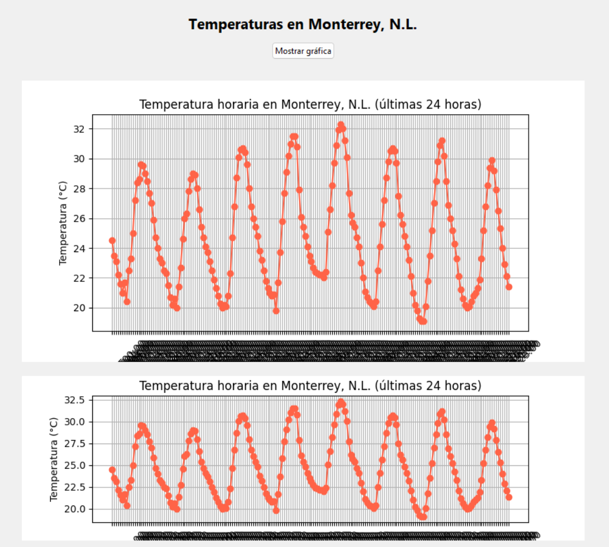

---

## Reflexión
Modifiqué el código para que en lugar de mostrar datos de León, Guanajuato, muestre las temperaturas horarias de Monterrey, Nuevo León, cambiando sus coordenadas en la URL de la API y actualizando todos los textos visibles en la ventana y la gráfica para reflejar la nueva ciudad. Además, eliminé todos los comentarios para que el código quedara más limpio y directo, pero conservando toda su funcionalidad original de obtener datos, graficarlos y mostrarlos en la interfaz de Tkinter.

---

```python
import tkinter as tk
from tkinter import ttk, messagebox
import requests
import matplotlib.pyplot as plt
from matplotlib.backends.backend_tkagg import FigureCanvasTkAgg

def fetch_data():
    try:
        url = (
            "https://api.open-meteo.com/v1/forecast"
            "?latitude=25.6866&longitude=-100.3161"
            "&hourly=temperature_2m&past_days=1"
            "&timezone=auto"
        )
        response = requests.get(url, timeout=15)
        response.raise_for_status()
        data = response.json()
        horas = data["hourly"]["time"]
        temperaturas = data["hourly"]["temperature_2m"]
        return horas, temperaturas
    except Exception as e:
        messagebox.showerror("Error", f"No se pudo obtener la información:\n{e}")
        return [], []

def plot_data():
    horas, temperaturas = fetch_data()
    if not horas:
        return
    fig, ax = plt.subplots(figsize=(8, 4))
    ax.plot(horas, temperaturas, marker="o", linestyle="-", color="tomato")
    ax.set_title("Temperatura horaria en Monterrey, N.L. (últimas 24 horas)")
    ax.set_xlabel("Hora")
    ax.set_ylabel("Temperatura (°C)")
    ax.tick_params(axis='x', rotation=45)
    ax.grid(True)
    canvas = FigureCanvasTkAgg(fig, master=window)
    canvas.draw()
    canvas.get_tk_widget().pack(pady=10)

window = tk.Tk()
window.title("Temperaturas - Monterrey, N.L.")
window.geometry("900x600")

frame = ttk.Frame(window, padding=20)
frame.pack(expand=True, fill="both")

ttk.Label(frame, text="Temperaturas en Monterrey, N.L.", font=("Segoe UI", 16, "bold")).pack(pady=10)
ttk.Button(frame, text="Mostrar gráfica", command=plot_data).pack()

window.mainloop()
